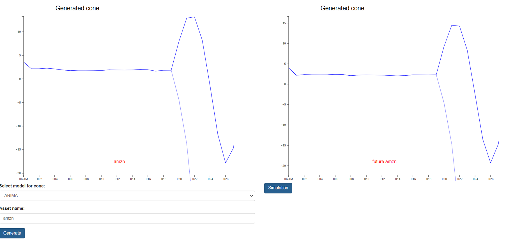
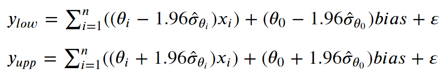
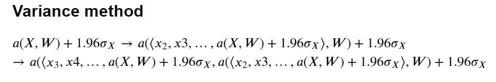
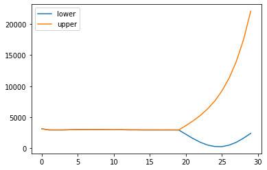
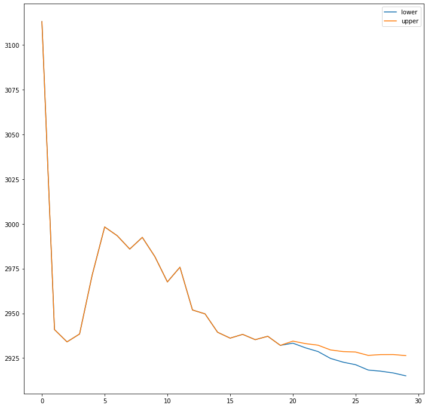
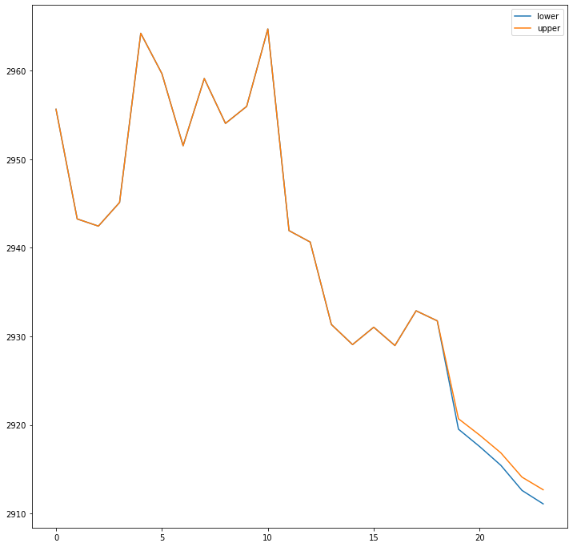
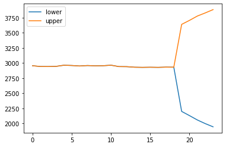
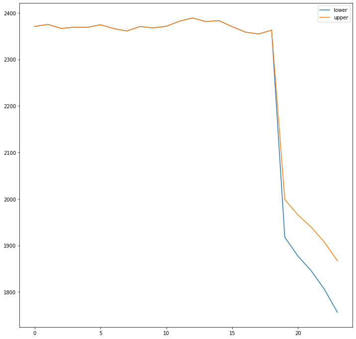

# Probability cone

`Research in probability-cone/python/research/market/market_analysis.ipynb`

### Constructing probability cone via 
- machine learning & statistics
  - regression model
  - NN, RNN, LSTM
  - different method for calculation standard error
- stochastic differential equations

### Software engineering challenges
- Configure docker compose
- Collecting and saving finance time series to postgres
- Creating methods for processing time series data
- Working with insides of `statsmodels` and `pytorch`

### Mathematical challenges
- Creating formulas to generate probability cone
- Probability cone via regression models

- Probability cone via neural network models

# Results

### Regression

 

### Deep models results

